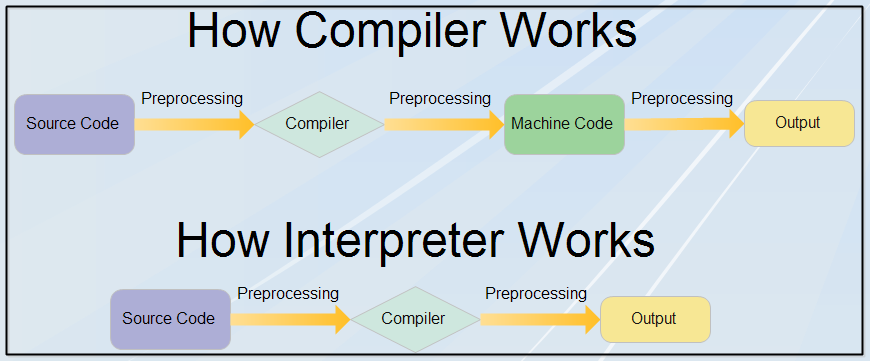

# Python Course by Cisco:
---------------------------
Use the below link and login to access the cource.

**[Login](https://skillsforall.com/)**

* The language which computers use is called as `Machine Language`.
* It(computer) responds only to a predetermined set of known `commands`.
* A complete set of known commands is called an `Instruction List(IL)`. These were differ from computer to computer depending on the size of IL's.
* Any language consists of some elements which determines the phrase of that language, they are:
    *  `An Alphabet` -- A set of symbols used to build words of a certain language(a, b, d etc.)
    *  `A lexis` -- A set of words the language offers its users like using the letters to phrase a word ( using g, a, b to phrase `bag`)
    *  `A syntax` -- A set of rules (formal or informal, written or felt intuitively) used to determine if a certain string of words forms a valid sentence ( eg: `I am Tarun` is syntactically right but `Tarun I am` is not.)
    *  `A semantics` -- A set of rules determining if a certain phrase makes sense (e.g., "I ate a doughnut" makes sense, but "A doughnut ate me" doesn't)

*  We need a language in which humans can write their programs and a language that computers may use to execute the programs, one that is far more complex than machine language and yet far simpler than natural language. Such languages are often called `high-level programming languages`. They are at least somewhat similar to natural ones in that they use symbols, words and conventions readable to humans. These languages enable humans to express commands to computers that are much more complex than those offered by ILs.

*  A program written in a high-level programming language is called a `source code`.Similarly, the file containing the source code is called the `source file`.

*  There are two different ways of transforming a program from a high-level programming language into machine language:
   *  `Compilation`:
      --------------
        *  The source program is translated once (however, this act must be repeated each time you modify the source code) by getting a file (e.g., an .exe file if the code is intended to be run under MS Windows) containing the machine code. Now you can distribute the file worldwide; the program that performs this translation is called a `Compiler` or `Translator`.        
        *  If the compiler finds an error, it finishes its work immediately. The only result in this case is an error message.
   *  `Interpretation`:
      -----------------
        *  You (or any user of the code) can translate the source program each time it has to be run. The program performing this kind of transformation is called an `Interpreter`, as it interprets the code every time it is intended to be executed. It also means that you cannot just distribute the source code as-is, because the end-user also needs the interpreter to execute it.
        *  First of all, the interpreter checks if all subsequent lines are correct (using the four aspects covered earlier(Alphabet, lexis, syntax and semantics)).
        *  The interpreter will inform you where the error is located and what caused it, but it follows our exact intentions.
        *  If the line looks good, the interpreter tries to execute it (note: each line is usually executed separately, so the trio `read-check-execute` can be repeated many times - more times than the actual number of lines in the source file, as some parts of the code may be executed more than once).
        *  It is also possible that a significant part of the code may be executed successfully before the interpreter finds an error. This is normal behavior in this execution model.

  
  

### Compilation:
-----------------
    * Advantages:
    -------------
        * The execution of the translated code is usually faster
        * Only the user has to have the compiler – the end-user may use the code without it
        * The translated code is stored using machine language – as it is very hard to understand it, your own inventions and programming tricks are likely to remain your secret.
 
    * Dis Advantages:
    -----------------
        * you have to have as many compilers as hardware platforms you want your code to be run on.
        * The compilation itself may be a very time-consuming process – you may not be able to run your code immediately after making an amendment.

### Interpretation:
-------------------
    * Advantages:
    -------------
        * You can run the code as soon as you complete it – there are no additional phases of translation.
        * The code is stored using programming language, not machine language - this means that it can be run on computers using different machine languages; you don't compile your code separately for each different architecture.
    
    * Dis Advantages:
    -----------------
        * Don't expect interpretation to ramp up your code to high speed - your code will share the computer's power with the interpreter, so it can't be really fast.
        * Both you and the end user have to have the interpreter to run your code.

* Python is an `Interpreted language`. If you want to program in Python, you'll need the Python interpreter. You won't be able to run your code without it.
* Languages designed to be utilized in the interpretation manner are often called `scripting languages`, while the source programs encoded using them are called `scripts`.
* Python was created by `Guido van Rossum`.
* There are two main kinds of Python, called `Python 2` and `Python 3`. 
* `Python 2` is an older version of the original Python.
* `Python 3` is the newer (or to be more precise, the current) version of the language.
* These two versions of Python aren't compatible with each other. `Python 2` scripts won't run in a `Python 3` environment and vice versa, so if you want the old `Python 2` code to be run by a `Python 3` interpreter, the only possible solution is to rewrite it, not from scratch, but you do have to revise all the code to find all possible incompatibilities. Unfortunately, this process cannot be fully automatized.
* All the newer versions of `Python 3` are backward compatible with the previous versions of `Python 3`.
* The traditional implementation of Python, called `CPython`, is Guido van Rossum's reference version of the Python computing language, and it's most often called just `Python`. When you hear the name `CPython`, it's most probably used to distinguish it from other, non-traditional, alternative implementations.
* `PSF` - `Python Software Foundation`.

### Python Implementations:
---------------------------
  * `Cython` (Using C language in Python for Large and Complex Mathematical operations)
  * `Jython` ( Using Python in java language)
  * `PyPy(RPython)` (Using Python in Python i.e. representing Python environment written in Python like language Restricted Python(RPython) )
  * `MicroPython` ( This is optimized to run on microcontrollers)
  * `CircuitPython` ( Used MicroPython to create this and used to run on microcontrollers hardware).